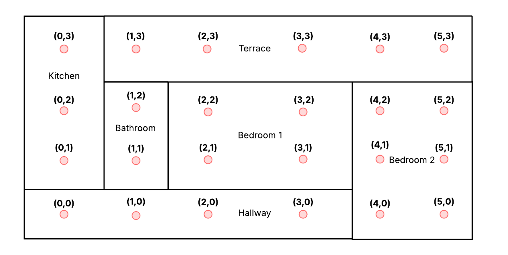
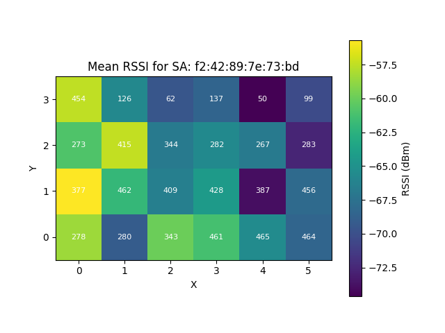
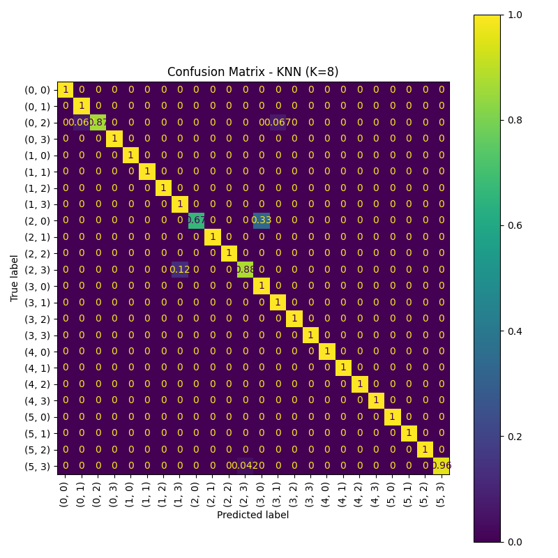

# WI - Indoor Localization System Using RSSI

This project implements and evaluates a Wi-Fi-based indoor localization system using RSSI (Received Signal Strength Indicator) data. The system is developed for the *Wireless Internet* (WI) course at Politecnico di Milano.

## Overview

The goal is to localize a device indoors by analyzing Wi-Fi signal strengths received from access points. The system was implemented and tested in a real residential environment, where signal data was collected, cleaned, and processed for training and evaluation of various machine learning algorithms.

## Features

- Preprocessing pipeline including:
  - Data cleaning
  - Dummy entry insertion
  - Data augmentation
- Heatmap visualization of MAC address signal distributions
- Implementation of 4 ML models:
  - **Probabilistic**: Horus, Bayesian Network
  - **Deterministic**: K-Nearest Neighbors (KNN), Random Forest
- Evaluation using:
  - Confusion matrices
  - Classification accuracy
  - Mean localization error (in meters)
 
## Visualization

### House Floor Plan

This grid was used during the data acquisition phase to collect RSSI values at predefined positions.

### Heatmap Example

This heatmap shows the signal intensity distribution for one of the selected MAC addresses.

### KNN Confusion Matrix

The confusion matrix illustrates the excellent performance of the KNN classifier.

## Results Summary

| Algorithm         | Accuracy | Mean Localization Error |
|------------------|----------|--------------------------|
| Horus            | 0.5377   | 1.07 m                   |
| Bayesian Network | 0.7722   | 0.46 m                   |
| KNN              | 0.9766   | 0.09 m                   |
| Random Forest    | 0.9672   | 0.08 m                   |

## Project Structure

- `*.py` – Python scripts for data manipulation and localization algorithms
- `*.csv` – Processed datasets (not included here)
- `*.png` – Confusion matrices, heatmaps, and accuracy plots
- `WN_IndoorLocalizationSystem.pdf` – Full project report

## Documentation

For full implementation details, methodology, and analysis, refer to the [project report](./WN_IndoorLocalizationSystem.pdf).
